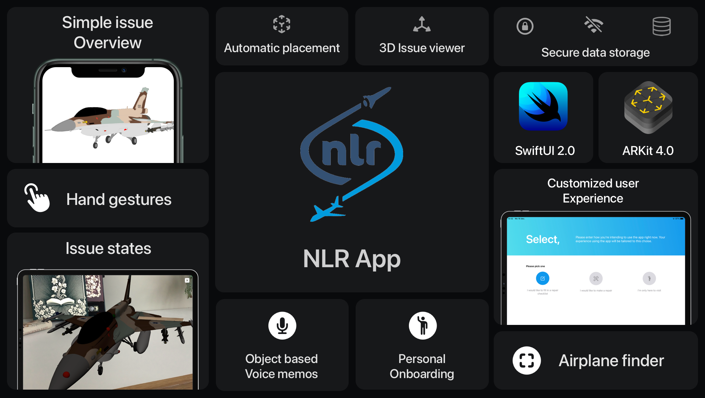

    

# NLR AR App
NLR AR App is an iOS app made for the organization [nlr](https://www.nlr.nl/). The app includes features like Augmented Reality, CoreData databases and SceneKit file previewing. It is made for constructors who maintain airplanes, so they can precisely add issues on the airplane.